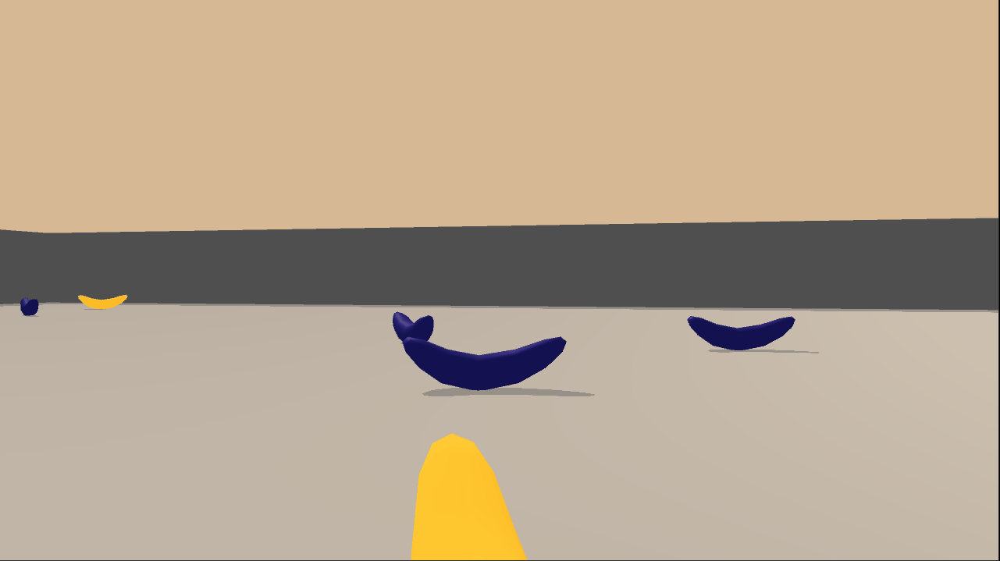

{
 "metadata": {
  "language_info": {
   "codemirror_mode": {
    "name": "ipython",
    "version": 3
   },
   "file_extension": ".py",
   "mimetype": "text/x-python",
   "name": "python",
   "nbconvert_exporter": "python",
   "pygments_lexer": "ipython3",
   "version": 3
  },
  "orig_nbformat": 2
 },
 "nbformat": 4,
 "nbformat_minor": 2,
 "cells": [
  {
   "cell_type": "markdown",
   "metadata": {},
   "source": [
    "# Learning algorithm\n",
    "For this project I used basic DQN algorithm with following parameters\n",
    "\n",
    "- Maximum number of timesteps per episode: 1000\n",
    "- Starting value of epsilon, for epsilon-greedy action selection: 0.1\n",
    "- Minimum value of epsilon: 0.001\n",
    "- Multiplicative factor (per episode) for decreasing epsilon (epsilon decay): 0.995\n",
    "\n",
    "I used following neural network model:\n",
    "\n",
    "- Fully connected layer - input size: 37 (state size) output size: 124\n",
    "- Fully connected layer - input: 124 output 124\n",
    "- Fully connected layer - input: 124 output 64\n",
    "- Fully connected layer - input: 64 output: 4 (action size)\n",
    "- I also used dropout to avoid over fitting. \n",
    "\n",
    "After less than 450 episodes agent reached average score of +13.0\n",
    "```\n",
    "Episode 100\tAverage Score: 0.73\n",
    "Episode 200\tAverage Score: 2.56\n",
    "Episode 300\tAverage Score: 7.37\n",
    "Episode 400\tAverage Score: 9.63\n",
    "Episode 500\tAverage Score: 12.41\n",
    "Episode 543\tAverage Score: 13.02\n",
    "Environment solved in 443 episodes!\tAverage Score: 13.02\n",
    "```\n",
    "",
    "\n",
    "### Untrained Agent\n",
    "",
    "\n",
    "### Trained Agent\n",
    "",
    "\n",
    "# Future Work Ideas\n",
    "- Train the agent to learn directly from pixels\n",
    "- Create a new Environment with different score and states and use same learning model.\n",
    "- Experiment with other algorithms such as Double DQN or Dueling DQN then compare the results."
   ]
  }
 ]
}